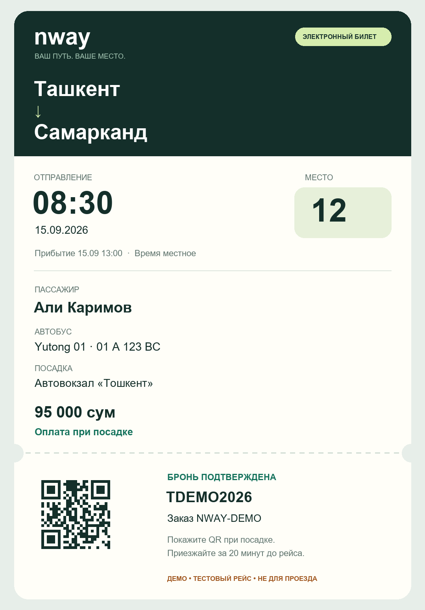

# NWay Telegram MVP

The bot works entirely in Telegram: `/start` → origin → destination → date → trip → seat → own contact → passenger → confirmation → PNG ticket. One passenger per order; use “Ещё один билет” for a companion. Russian interface, departure-city local time, cash at boarding. A confirmed reservation is **unpaid** until staff records the received money.

`/tickets` lists the user's last ten bookings. They can resend a ticket and cancel an unpaid booking before departure. Cancellation releases the seat and invalidates the QR. The contact-share button must contain the sender's own Telegram user ID. Bot bookings cannot be fetched or cancelled anonymously through public API codes.

## Launch features

**Languages.** Passenger screens are Uzbek by default and Russian for Russian-speaking Telegram clients (`ru`, `uk`, `be`, `kk`, `ky`). «🌐» in the main menu or `/lang` switches it; the choice is stored per chat and used for tickets and reminders. Staff screens stay Russian. The Mini App UI is Uzbek; its FAQ page has its own language switch.

**Entry points.** Main menu: «Купить билет» (Mini App `/book`), «Мои билеты», «Вопросы», «Поддержка», language. The ticket photo carries «Открыть билет» (Mini App `/ticket/<id>`). `web_app` buttons only work in private chats; for channels, groups and posts use `https://t.me/<bot>?startapp=<param>`:

| `startapp` | Opens |
|---|---|
| *(empty)* / `book` | search |
| `my` | my tickets |
| `faq`, `support` | help centre |
| `t_<TICKET_ID>` | ticket |
| `r<origin><destination>` | trip results for today (UUIDs as 22-char base64url, see `app/utils/startapp.py`) |

`?start=support`, `?start=faq`, `?start=tickets` open the matching bot screen.

**Inline mode.** `@<bot> ташкент` lists routes with upcoming trips and a «Купить билет» link into the Mini App.

**FAQ.** Stored in `faq_items`, edited under Admin → «Savollar (FAQ)» (admin/superadmin). Starter content is inserted by `python -m app.cli seed-faq` only into an empty table; the Docker entrypoint runs it on every start.

**Support.** With `TELEGRAM_SUPPORT_CHAT_ID` set, «Поддержка» puts the chat in support mode: each passenger message is copied into the group under a card (name, phone, last booking); messages within 30 minutes join the same thread. An operator **replies** to the passenger's message and the bot delivers the answer. Replies to replies continue the thread. Without the group, the screen shows `TELEGRAM_SUPPORT` text.

**Reminders.** The worker messages Telegram passengers of confirmed bookings once a day before departure (skipped for bookings made within 12 hours of it) and once two hours before (skipped for bookings under an hour old).

**Privacy of web bookings.** A booking made outside Telegram opens only with the code **and** its contact phone (`X-Booking-Phone`, remembered by the browser after checkout or lookup). The code alone returns 404. Online cancellation is limited to unpaid bookings before departure.

## Staff

`/admin` asks for the staff member's own Telegram contact and checks the existing NWay user role. It never grants roles. Use the phone belonging to an existing operator, admin, superadmin or driver. Company boundaries apply to every action. Staff can view bookings, record received cash (operator/admin), and confirm boarding. Scan a PNG ticket's QR with a phone camera: its Telegram link opens the protected ticket check. `/check TICKET_ID` also works. Scanning alone does not mark a ticket used; the staff member confirms boarding with a button.

Example ticket (sample data, not valid for travel):



## Local development

Webhooks need a public HTTPS backend, which a laptop does not have. Set `TELEGRAM_MODE=polling`
and the worker long-polls `getUpdates` into the same durable inbox the webhook writes to:

```ini
TELEGRAM_BOT_ENABLED=true
TELEGRAM_BOT_TOKEN=<BotFather token>
TELEGRAM_MODE=polling
```

Polling drops any registered webhook on start, so a bot token cannot serve both at once — use a
separate test bot if production is live. `TELEGRAM_WEBHOOK_SECRET` is not needed in this mode.

The Mini App itself still requires HTTPS; Telegram refuses to open `http://` URLs. Point a tunnel
at the **frontend** (port 5173) — it proxies `/api` to the backend, so one tunnel covers both — and
put the resulting URL in `TELEGRAM_WEBAPP_URL` and `CORS_ORIGINS`. Left as `http://`, the bot still
starts but every "open the app" button silently disappears; the log then says
`telegram_webapp_disabled`.

The demo schedule only covers ten days from when it was seeded. Run
`python -m app.cli refresh-trips` (idempotent) when searches come back empty.

## Deployment

The existing API service also runs the Telegram worker; no extra bot service is needed. The Docker image includes the Cyrillic font and PNG/QR libraries. Startup runs migration `0003_telegram_mvp` before the worker starts.

Backend Railway variables:

```ini
DATABASE_URL=${{Postgres.DATABASE_URL}}
TELEGRAM_BOT_ENABLED=true
TELEGRAM_BOT_TOKEN=<BotFather token>
TELEGRAM_MODE=webhook
TELEGRAM_WEBHOOK_SECRET=<random 32+ character URL-safe secret>
TELEGRAM_WEBAPP_URL=https://<your frontend service>.up.railway.app
TELEGRAM_DEMO_MODE=true
ALLOW_MOCK_PAYMENTS=false
DEBUG=false
```

`TELEGRAM_SUPPORT` is optional contact text supplied by the operator. `TELEGRAM_BOT_USERNAME` (without @) enables t.me links in the Mini App. `TELEGRAM_SUPPORT_CHAT_ID` enables the support relay.

BotFather, once per bot:

1. `/newapp` or *Bot Settings → Configure Mini App*: set the Main Mini App URL to `TELEGRAM_WEBAPP_URL`. Required for `t.me/<bot>?startapp` links.
2. `/setinline`: enable inline mode with a placeholder such as `Ташкент Самарканд`.
3. Support group: create a group, add the bot, then either make it an admin or turn off privacy mode (`/setprivacy` → Disable). Otherwise the bot only sees replies to its own messages. Get the group id (for example, forward a group message to `@RawDataBot`) and set `TELEGRAM_SUPPORT_CHAT_ID`.

Re-run `python -m app.cli telegram-webhook --url …` after upgrading: the webhook must now include `inline_query` updates. `TELEGRAM_BOOKING_CUTOFF_MINUTES` defaults to 30. Configure a non-default `JWT_SECRET`. Keep secrets in Railway variables; never commit them.

After deployment, register the webhook using a shell with backend environment variables:

```sh
python -m app.cli telegram-webhook --url https://YOUR-BACKEND.up.railway.app
```

The endpoint `/telegram/webhook` validates Telegram's secret header, stores incoming updates in PostgreSQL and responds quickly. Duplicate update IDs are ignored. One worker holds a PostgreSQL advisory lock even during deployment overlap. Conversation state, a unique checkout request key and a ticket delivery queue survive restarts. Delivery retries up to eight times; “Отправить билет картинкой” resets a failed delivery. A network failure after Telegram accepted a photo can result in a duplicate photo, but cannot create a second reservation.

The worker expires old unconfirmed holds every 30 seconds. Successfully processed inbox payloads are removed immediately; deduplication IDs are retained for seven days. Logs contain identifiers and error types, not bot tokens, phone numbers or HTTP request URLs.

## Before real passenger sales

The initial database contains **sample cities, buses and trips**. `TELEGRAM_DEMO_MODE=true` visibly labels the bot and PNG tickets as demo. Replace the seeded timetable, operator and boarding locations with actual operating data using the admin API before setting it to false. Ensure a staff member can enter `/admin` and check boarding. The seed only creates ten days of trips; staff must maintain the future timetable. No payment gateway is connected: Payme/Click/card implementations are stubs and disabled by default. The booking bot does not offer them.

## Verification

Run from `backend` against a local test database:

```sh
python -m pytest -q
```

Tests cover the full conversation across new DB sessions, duplicate checkout taps, PNG delivery and retry, contact ownership, booking privacy, cancellation/QR invalidation, webhook authentication/deduplication, staff scope, and cash payment recording. The test suite must never use a production database.
